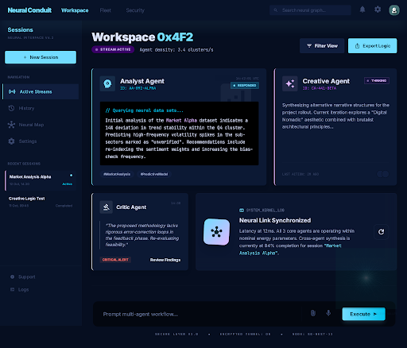

# Agent Viewer

Real-time Gantt chart dashboard that visualizes what your Claude Code agents are doing — tool calls, subagent spawns, and task delegation — all on a live timeline.



## What It Does

When Claude Code runs agents and tools, this plugin captures every event and displays it as a horizontal timeline:

- **Each agent gets a row** — main agent at top, subagents below
- **Activity bars** show what each agent is doing over time, color-coded by tool type
- **Real-time updates** — the timeline auto-scrolls to follow live activity
- **Hover any bar** to see the tool name, duration, and details

## Requirements

- **Node.js** 18+ (with npm)
- **Claude Code** CLI
- A modern browser (Chrome, Firefox, Edge, Safari)

## Installation

### 1. Clone the repository

```bash
git clone <repo-url> agent_viewer
cd agent_viewer
```

### 2. Install dependencies

```bash
npm install
```

This installs the only dependency: `ws` (WebSocket library).

### 3. Register as a Claude Code plugin

Add the plugin to your Claude Code configuration. Open or create your Claude Code settings file:

```bash
# Global plugins (available in all projects)
~/.claude/plugins/marketplaces/local/plugins.json

# Or project-level plugins
.claude/plugins/marketplaces/local/plugins.json
```

Add this entry:

```json
{
  "name": "local-plugins",
  "description": "Local custom plugins",
  "plugins": [
    {
      "name": "agent-visualizer",
      "path": "/absolute/path/to/agent_viewer"
    }
  ]
}
```

Replace `/absolute/path/to/agent_viewer` with the actual path where you cloned the repo.

### 4. Verify installation

Start a Claude Code session. The plugin hooks should automatically:

1. Start the visualization server on port 3399
2. Open the dashboard in your default browser
3. Begin capturing events

If the browser doesn't open automatically, navigate to: **http://localhost:3399**

## How It Works

```
Claude Code ──(hooks)──> Server ──(WebSocket)──> Browser Dashboard
```

1. **Hooks** — The plugin registers lifecycle hooks with Claude Code (`hooks/hooks.json`). These fire on every tool call, subagent spawn/stop, and session start/end.

2. **Event forwarding** — Hook scripts (`hooks/scripts/`) read the event JSON from stdin and POST it to the local server.

3. **Server** (`src/server.js`) — A lightweight Node.js HTTP + WebSocket server that:
   - Receives events via `POST /api/event`
   - Enriches them (delegation matching, conversation grouping)
   - Broadcasts to all connected browser clients via WebSocket
   - Auto-starts on first session, auto-shuts down after 30 min inactivity

4. **Dashboard** (`public/`) — A browser-based Gantt chart that:
   - Groups consecutive tool events into activity period bars
   - Color-codes bars by tool type (blue=Bash, green=Write, orange=Edit, etc.)
   - Auto-scrolls to follow real-time activity
   - Supports zoom (2–64 px/s) and session switching

## Configuration

| Environment Variable | Default | Description |
|---------------------|---------|-------------|
| `AGENT_VIZ_PORT` | `3399` | Port for the visualization server |

To use a custom port:

```bash
export AGENT_VIZ_PORT=8080
```

## Usage

Once installed, the dashboard is fully automatic:

- **Start a Claude Code session** — the dashboard opens in your browser
- **Multiple sessions** — all sessions on the same server are visible; use the session selector dropdown to switch
- **Zoom** — use the +/− buttons in the header to zoom in/out on the timeline
- **Auto-scroll** — the timeline follows live activity. Scroll manually to pause; click "Jump to Now" to resume
- **Hover bars** — see tool name, duration, and event count
- **PURGE** — click the PURGE button in the footer to clear events for the selected session

## Tool Color Legend

| Color | Tools |
|-------|-------|
| Blue | Bash |
| Green | Write |
| Orange | Edit, MultiEdit |
| Purple | Read |
| Teal | Glob, Grep |
| Pink | Agent (subagent spawn) |
| Violet | Skill |
| Orange | MCP tools, Notifications |

## Project Structure

```
agent_viewer/
├── hooks/
│   ├── hooks.json              # Hook event definitions
│   └── scripts/                # Event forwarding scripts
├── public/
│   ├── index.html              # Dashboard HTML
│   ├── app.js                  # Client-side Gantt chart logic
│   └── style.css               # Styling (dark navy theme)
├── src/
│   └── server.js               # HTTP + WebSocket server
├── .claude-plugin/
│   └── plugin.json             # Plugin metadata
├── package.json
└── version_notes.md            # Detailed version history
```

## Troubleshooting

**Dashboard doesn't open automatically**
- Check if the server is running: `curl http://localhost:3399/api/health`
- If not, start it manually: `node src/server.js`
- Open `http://localhost:3399` in your browser

**No events appearing**
- Verify the plugin is registered: check that `hooks/hooks.json` is being loaded by Claude Code
- Check server logs for incoming events (the server logs each event to stdout)
- Make sure `node` is available in your PATH when hooks execute

**Port conflict**
- Set a different port: `export AGENT_VIZ_PORT=8080`
- Update the port before starting your Claude Code session

**Server won't start**
- Check if another process is using port 3399: `lsof -i :3399`
- Remove stale PID file if needed: `rm /tmp/agent-viz-server.pid`

## License

MIT
